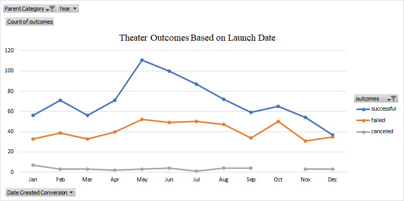
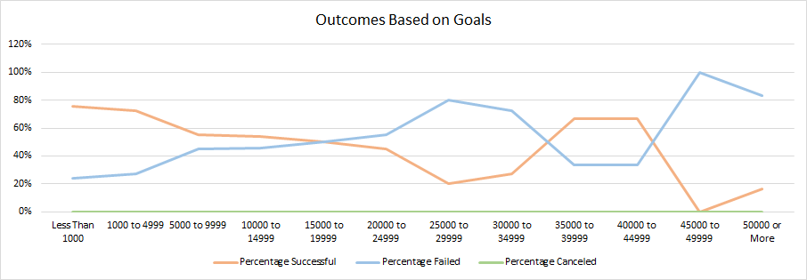

# Kickstarting with Excel

## Overview of Project

### This project is a collection of data that was gathered to help improve funding outcomes for a theater play. Data was collected on the amount pledged and the goal amount to determine whether or not a campaign was successful or had failed. Dates and Times were also collected to determine whether or not any trends could be identified based on time of the year.

## Analysis and Challenges

### Analysis of Outcomes Based on Launch Date 
This data was pulled from the begin date of all of the plays to provide a timeline to identify any trends. From the graph, we see that 
May had the highest successful outcome rate, followed by June and July. We can also see that the Month of June had the lowest successful 
outcome rate, followed by January then March. As for failed campaigns, it is pretty steady throughout with the exception of a spike in 
October. The same analysis can be applied for the campaigns that were canceled.

### Analysis of Outcomes Based on Goals 
This data was pulled from the goal amount to determine whether or not a goal was succesful or failed. From the graph, we see that there 
is a steady trend of 0% for plays canceled across all categories. The goals that were under 5000 had a higher success rate than goals over 5000. 
Goals that were set between 5000 and 24999 were close in percentages, meaning that just about half of the campaigns were successful and 
half of the campaigns failed. Campaigns with goals between 25000 and 34999 and over 45000 had the highest percentage of failed rates. 
Lastly, goals set between 35000 to 44999 had asimilar success and fail rate to those campaigns whose goals were under 5000.

### Challenges and Difficulties Encountered
There were not any difficulties or challenges faced during the data collection or analysis. However, there is a possible challenge 
in assuring the accuracy in percentages when breaking the goals down into categories. Since the goals are rounded to whole numbers, it
changes which category a goal would fall into.

## Results

- What are two conclusions you can draw about the Outcomes based on Launch Date?
Goals that start in warmer months are more likely to be successful than goals that start in colder months. Furthermore, the
time of year did not affect the number of goals that were canceled.
- What can you conclude about the Outcomes based on Goals?
Goals that are smaller are more likely to be achieved than goals that are higher (i.e. over 5000) On the other hand, the goal
amount did not effect the number of goals canceled, in fact none of the goals were canceled.
- What are some limitations of this dataset?
This dataset only looks at plays within the theater category and not other subcategories which can tell a different picture. 
In addition, each campaign has a different start date and deadline but does not compare how each play did within the same 
timeframe. Also, each campaign has a different amount of time to reach their goal, which can skew the outcome. If some campaigns 
had more time to accomplish the same goal it is not noted.
- What are some other possible tables and/or graphs that we could create?
A table could be included to show the amount pledged to determine how much over the goal each campaign made if applicable. Also,
another table could be created to display the time in between the start date and goal date to determine how much time each
campaign has had to complete their goal.
